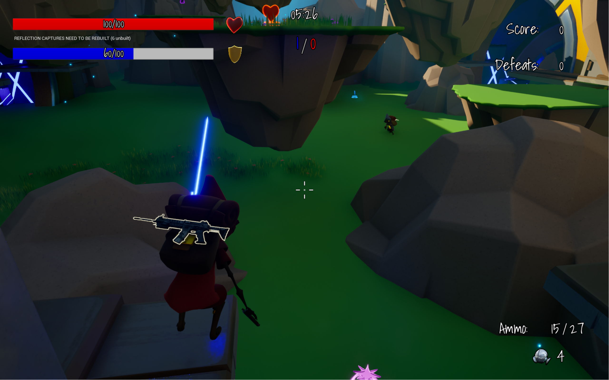

多人射击游戏(基于虚幻5.4实现)

采用Client-Server模型，服务端是权威，实现方式采用ListenServer，其中一个正在玩游戏的玩家是服务端。

项目特点如下:
1.实现了一个可以重复用于各种多人游戏的联机插件。该插件通过虚幻引擎在线子系统OnlineSubsystem连接到Steam服务，托管我们的多人游戏进行联机。

2.多种武器，主要有两大类：InstantHit和Projectile。其中InstantHit有手枪、冲锋枪、散弹枪和狙击枪。Projectile有步枪、榴弹枪、火箭筒以及手榴弹。冲锋枪以及散弹枪等武器实现了散射功能。

3.丰富的动作动画、特效和声音，角色在拾取武器前可以移动，潜行，下蹲，跳跃，拾取武器（最多两把）以及拾取旗帜（不能进行除移动外的其他操作）。角色拾取武器后可以转向、瞄准、扫射、开火、交换武器、换子弹和投掷手榴弹。角色被消灭会有死亡动画，被武器击中会有受击动画。

4.多种拾取物品，玩家可以在地图中拾取各类武器子弹以及Buff，Buff包括回血、加盾、加速和跳跃。

5.滞后补偿，提高延迟较高玩家的游戏体验。对于不是很重要的事情，可以不需要等到服务端确认，在客户端进行预表现，比如开火特效，显示拾取窗口，开火时减少子弹数，瞄准，播放换弹动画和播放交换武器动画。此外，还使用了服务端倒带技术，当客户端玩家开火命中敌人时，会发送消息到服务端进行验证，服务端存储了角色一段时间的历史位置，服务端根据客户端的命中时间倒带至该历史位置并判断是否造成伤害。

6.多种游戏模式，包括个人竞技（玩家可以攻击任意玩家，得分最高的玩家获胜）、团队竞技（玩家只能攻击其他队伍的玩家，不能攻击自己队伍的玩家，得分最高的队伍获胜）以及夺旗模式（玩家需要前往敌方队伍的基地夺取旗帜并送回自己基地，夺旗数最高的队伍获胜）

